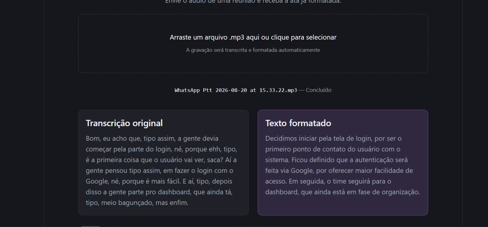
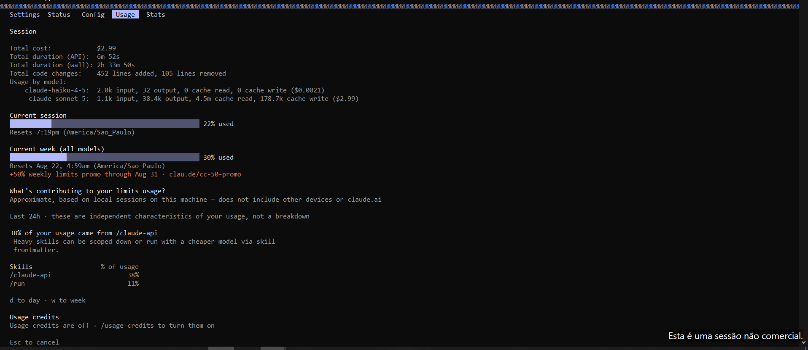
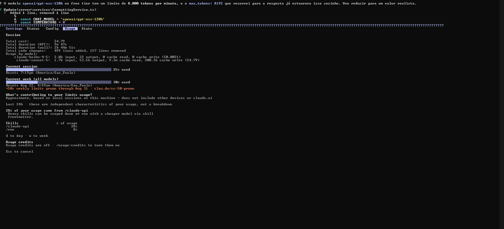
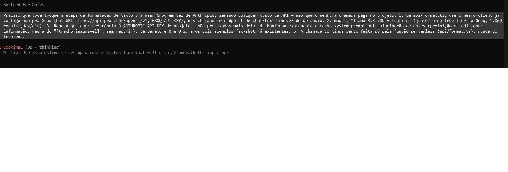
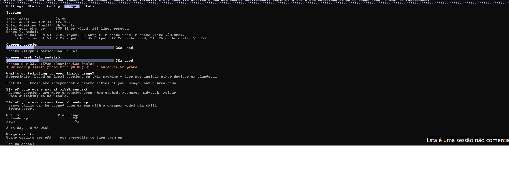
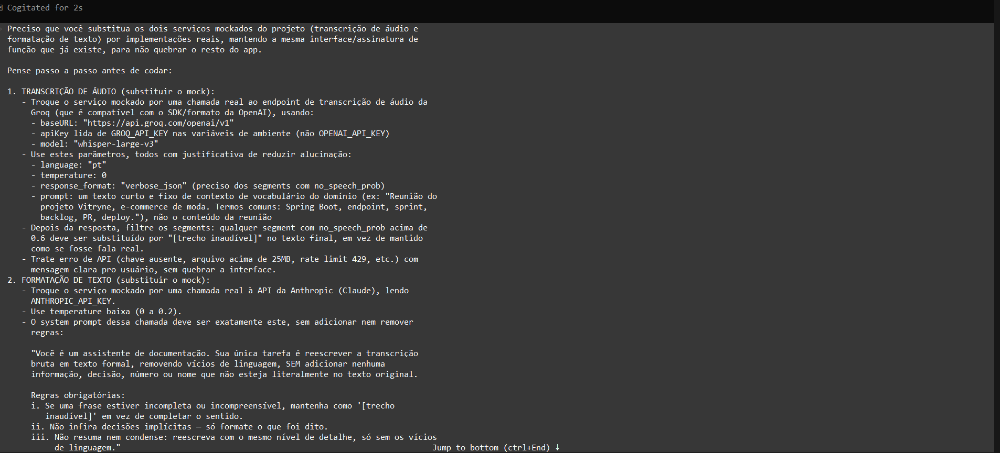
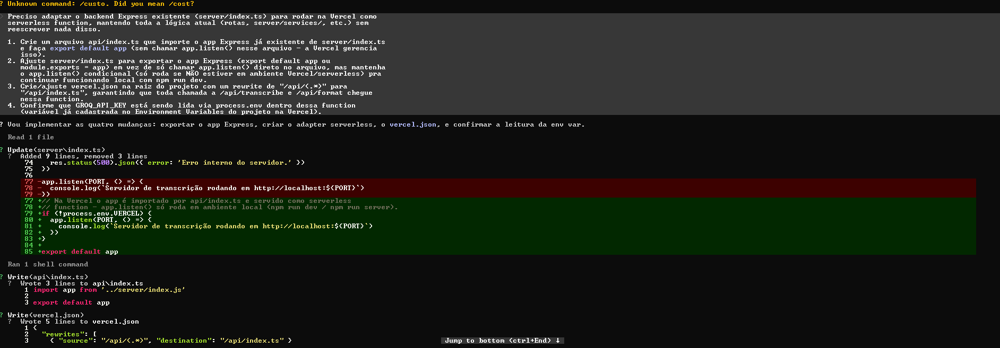

# Transcritor de Reuniões — Vitryne (AudioScript)

Trabalho prático de Engenharia de Prompt com Claude Code.

**URL publicada:** https://transcritor-reunioes-nine.vercel.app/

---

## 1. O que o projeto faz e qual opção o grupo escolheu

O AudioScript é uma ferramenta interna de produtividade para as reuniões do projeto Vitryne. O usuário envia um arquivo `.mp3` por drag and drop, a aplicação transcreve o áudio e devolve duas versões do conteúdo lado a lado: a transcrição bruta, com os vícios de linguagem típicos da fala, e a versão formatada como ata de reunião, em texto fluido e formal.

O grupo escolheu a opção de **projeto de estudo e produtividade pessoal**, e não a feature da Escola de TI.

A base foi construída em React, Vite e TypeScript. O projeto passou por duas fases: primeiro os serviços de IA foram implementados como mocks, para validar o fluxo da interface, e depois foram refatorados para chamar APIs reais, com uma função serverless na Vercel intermediando as requisições para que a chave de API não fique exposta no frontend.

Estrutura principal:

```
src/
  types/transcription.ts              tipos ProcessingStage e TranscriptionSession
  services/whisperService.ts          transcrição do áudio
  services/formattingService.ts       formatação do texto, contém o prompt few-shot
  components/AudioDropzone.tsx        drag and drop, valida .mp3 por extensão e MIME
  components/ProcessingStatus.tsx     estados de transcrevendo, formatando e erro
  components/TranscriptionResult.tsx  exibição lado a lado
  components/TranscriptionWorkspace.tsx  orquestra o fluxo e mantém o estado
```



---

## 2. System prompt usado

Definido no arquivo `CLAUDE.md`, na raiz do projeto, antes de qualquer geração de código:

```
Você é um Desenvolvedor Frontend Sênior, especialista em React, TypeScript e integração
com APIs de Inteligência Artificial. Seu objetivo é desenvolver protótipos funcionais,
limpos e bem documentados.

Regras inegociáveis:
1. É absolutamente obrigatório definir e tipar todas as propriedades (props) no TypeScript.
2. O uso de 'any' é estritamente proibido.
3. O código gerado deve ser modular, focado em uma única responsabilidade por componente.
4. O contexto desta aplicação é uma ferramenta interna de produtividade para as reuniões
   do projeto Vitryne.
```


Modelo utilizado na sessão: **Sonnet 5**, via Claude Code v2.1.237.


---

## 3. Técnica aplicada e justificativa

Foram combinadas duas técnicas no mesmo prompt de geração, cada uma resolvendo um problema diferente.

**Chain-of-Thought.** A feature não é uma tarefa única, e sim quatro etapas encadeadas: receber o arquivo, transcrever, formatar e exibir o resultado. Em um pedido solto, a IA tende a pular etapas ou concentrar responsabilidades em um único componente, o que violaria a regra de modularidade definida no system prompt. Numerar as etapas e pedir explicitamente que ela pensasse passo a passo produziu a separação em types, services e components.

**Few-Shot.** O requisito de formatação não era apenas deixar o texto mais formal, era remover vícios de linguagem sem alterar o sentido do que foi dito na reunião. Esse tipo de instrução é difícil de transmitir por adjetivos, mas fácil de transmitir por exemplo. Foram fornecidos dois pares de entrada e saída, e o padrão passou a ser definido pela demonstração em vez da descrição.

Um ponto que vale destacar: o prompt de few-shot não foi escrito para o Claude Code. Ele foi embutido dentro do código, no serviço de formatação, porque é o prompt que a aplicação usa ao chamar a LLM. Existem, portanto, dois níveis de prompt no projeto: o que gerou o código e o que o código carrega dentro de si.


---

## 4. Teste de curadoria de contexto

Foram executadas duas rodadas. A primeira produziu resultado contrário à hipótese, o que levou a uma revisão do desenho experimental e a uma segunda rodada.

### Metodologia

Mesma tarefa nos dois cenários, variando apenas o contexto fornecido. Cada teste foi executado em uma sessão nova do Claude Code, de forma que o valor exibido pelo `/cost` refletisse apenas aquela chamada e não o acumulado da sessão anterior. Entre um teste e outro a alteração foi desfeita com `git checkout`, garantindo o mesmo estado inicial de arquivo.

### Primeira rodada: inserção de uma tag no rodapé

| Métrica | Teste A (arquivo inteiro) | Teste B (só o trecho) |
|---|---|---|
| Tokens de entrada | 512 | 514 |
| Tokens de saída | 493 | 623 |
| Cache read | 176,5k | 222,5k |
| Cache write | 45,0k | 45,0k |
| Custo pelo `/cost` | $0,3341 | $0,3495 |


O resultado foi o oposto do esperado: o Teste B custou 4,6 por cento a mais. A investigação apontou duas causas. Primeiro, após a geração inicial o código foi modularizado, e o `App.tsx` passou a ser apenas um invólucro que importa outro componente, de modo que o trecho enviado não era autossuficiente. Segundo, o Claude Code é uma ferramenta agêntica: ela lê e edita arquivos por conta própria. Colar o trecho no prompt não substituiu a leitura do arquivo, apenas somou conteúdo ao que já seria lido de qualquer forma. O cache read maior no Teste B confirma isso.

### Segunda rodada: adição de dois botões funcionais

O desenho foi corrigido em dois pontos. A tarefa passou a ser maior, com dois botões usando Clipboard API e Blob, e o Teste 2 recebeu uma restrição explícita ao comportamento agêntico: *não leia nenhum arquivo do projeto, devolva o código alterado como resposta em texto, sem editar arquivos*. O trecho enviado incluiu a interface de props, tornando-o autossuficiente.

| Métrica | Teste 1 (arquivo inteiro) | Teste 2 (só o trecho) |
|---|---|---|
| Tokens de entrada | 524 | 2 |
| Tokens de saída | 3,4k | 1,0k |
| Cache read | 484,2k | 0 |
| Cache write | 51,1k | 45,0k |
| Duração da API | 41s | 11s |
| Duração total | 3m 16s | 2m 26s |
| Custo pelo `/cost` | $0,51 | $0,2875 |


O Teste 2 custou cerca de 44 por cento menos pelo `/cost` e cerca de 71 por cento menos pelo cálculo manual da fórmula do enunciado.

A diferença central está no cache read: 484,2k tokens contra zero. No Teste 1, mesmo diante de uma alteração pontual, a ferramenta releu o arquivo e os arquivos vizinhos para garantir consistência de props, tipos e CSS. No Teste 2, a restrição explícita tirou a ferramenta do modo agêntico e ela respondeu como uma chamada de API pura, baseada apenas no texto colado.

### Conclusão

A curadoria de contexto só reduz custo de fato quando vem acompanhada de uma restrição explícita ao comportamento agêntico da ferramenta. O ganho não vem de colar menos texto no prompt, vem de impedir que a ferramenta compense a falta de contexto buscando o resto do projeto sozinha, que é justamente o que gera o grande volume de cache read e o custo mais alto.

---

## 5. Tabela com todas as chamadas

Modelo: **Sonnet 5** (`claude-sonnet-5`), via Claude Code v2.1.237. Preços de referência: $2,00 por milhão de tokens de entrada e $10,00 por milhão de tokens de saída.

| # | Chamada | Entrada | Saída | Cache read | Cache write | Custo calculado | Custo pelo `/cost` |
|---|---|---|---|---|---|---|---|
| 1 | Geração principal (CoT + few-shot) | 576 | 15,8k | 2,7m | 92,1k | $0,1592 | $1,5900 |
| 2 | Rodapé — Teste A (arquivo inteiro) | 512 | 493 | 176,5k | 45,0k | $0,0060 | $0,3341 |
| 3 | Rodapé — Teste B (só o trecho) | 514 | 623 | 222,5k | 45,0k | $0,0073 | $0,3495 |
| 4 | Botões — Teste 1 (arquivo inteiro) | 524 | 3,4k | 484,2k | 51,1k | $0,0350 | $0,5100 |
| 5 | Botões — Teste 2 (só o trecho) | 2 | 1,0k | 0 | 45,0k | $0,0100 | $0,2875 |
| 6 | Refatoração para chamar API real | | | | | | |
| 7 | Troca do provedor (Groq para Anthropic) | | | | | | |
| 8 | Ajuste da formatação do texto | | | | | | |
| 9 | Adaptação com Express para a Vercel | | | | | | |
| | **TOTAL DA SESSÃO** | | | | | | |













### Cálculo manual, aplicando a fórmula do enunciado

```
custo = (tokens_entrada / 1.000.000) x preco_entrada
      + (tokens_saida  / 1.000.000) x preco_saida

Botões — Teste 1 = (524 / 1.000.000) x 2 + (3.400 / 1.000.000) x 10
                 = 0,001048 + 0,034000
                 = $0,035048

Botões — Teste 2 = (2 / 1.000.000) x 2 + (1.000 / 1.000.000) x 10
                 = 0,000004 + 0,010000
                 = $0,010004
```

Os valores calculados ficam consistentemente abaixo dos exibidos pelo `/cost`. A diferença é explicada pelo fato de a fórmula do enunciado considerar apenas tokens de entrada e saída, enquanto a cobrança real inclui também leitura e escrita de cache, que possuem tarifas próprias. Como o volume de cache chegou à casa dos milhões de tokens, ele responde por quase todo o valor apresentado pela ferramenta. Essa é a razão pela qual a economia observada no teste de curadoria aparece com magnitudes diferentes nas duas formas de medir: 44 por cento pelo `/cost` e 71 por cento pela fórmula.


---

## 6. Comprovação dos números

Os números da tabela foram extraídos do transcript da sessão, em `~/.claude/projects/`, onde cada mensagem do assistente registra um bloco `usage` com `input_tokens` e `output_tokens`, e conferidos contra a saída do comando `/cost`.

---

## 7. URL publicada

https://transcritor-reunioes-nine.vercel.app/

Deploy feito na Vercel a partir do repositório do GitHub, com detecção automática do framework Vite. A chave de API fica em variável de ambiente na Vercel e as chamadas passam por função serverless, de modo que a credencial não é exposta no frontend.

---
OBS:  Todas as prints estão na pasta de evidencias.
## 8. Integrantes

| Nome | RA |
|---|---|
| João Fernando Ehlers | 23317130-2 |
| Leonardo Xavier Rodrigues | 23178963-2 |
| Bruno Valério Abrahim | 23000333-2 |
